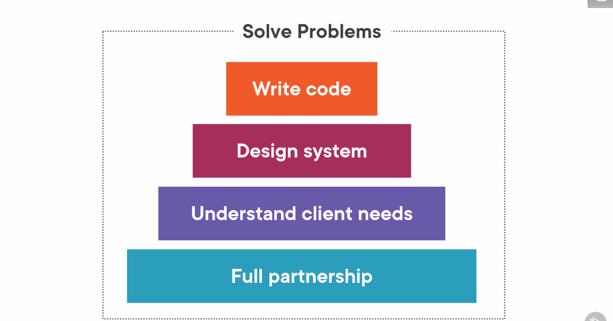
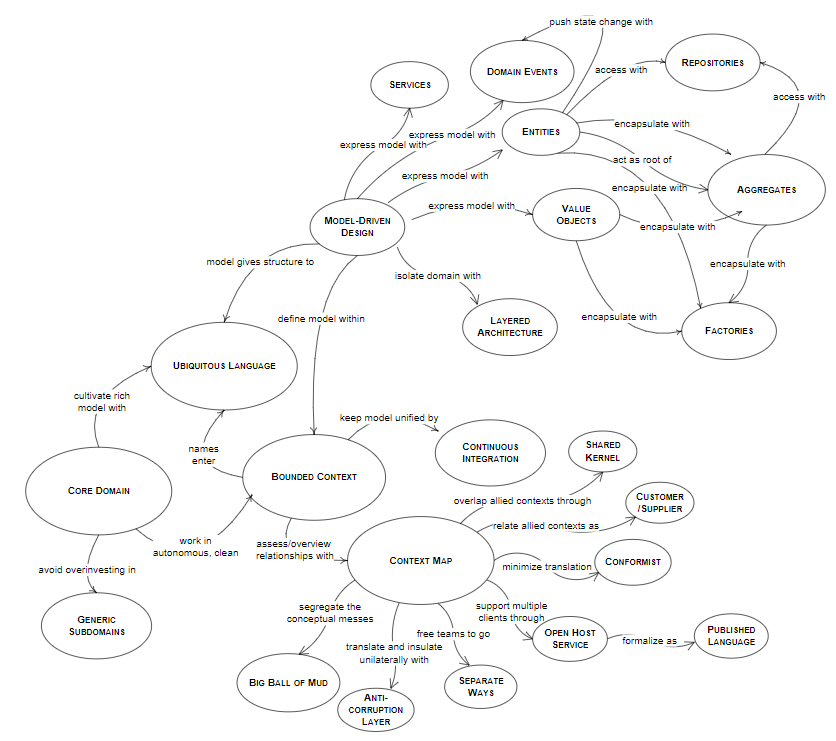

bb# 1 Domain Driven Design

## What is Domain ?

- Domain là từ được sử dụng trong bối cảnh phát triển phần mềm đề cập đến kinh doanh. Trong quá trình pt ứng dụng, domain logic hoặc business logic thường được sử dụng. Business Logic của một ứng dụng là tập hợp các quy tắc va hướng dẫn giải thích cách đối tượng kinh doanh nên tương tác với nhau để xử lý dữ liệu được mô hình hóa.

> Miền trong lĩnh vực kỹ thuật phần mềm là lĩnh vực kinh doanh mà ứng dụng được dự định xây dựng.

- Domain Driven Design nói về hai loại công cụ thiết kế, Strategic design tools (Công cụ thiết kế chiến lược) và Tactical design tools (Công cụ thiết kế chiến thuật).Các lập trình viên hoặc nhà phát triền thường đối phó với Tactical design tools

- Phần lớn các framework thuộc họ Spring được xây dựng dự trên cách tiếp cận Domain-Driven.

- **Strategic design tools:** Các công cụ này giúp ta giả i quyết tất cả vấn đề liên quan tới mô hình phần mềm. Đó là một cách tiếp cận thiết kế tương tự oob, nơi chúng ta phải suy nghĩ về các đối tượng. Theo đó, thiết kế chiến lược, chúng tôi buộc phải suy nghĩ về context.

- **Context:** : đây là một từ đề cập đến hoàn cảnh của một sự kiện, sự cố, tuyên bố hoặc ý tưởng và về mặt nào thì ý nghĩa của nó có thể được xác định. Ngoài context, thiết kế chiến lược cũng nói về Model, Ubiquitous Language, Bounded Context

  - **Model:** nó hoạt động như một logic cốt lõi và môt tả các khía cạnh được lựa chọn của miền, nó được sử dụng để giải quyết các vần đề liên quan đến doanh nghiệp đó.
  - **Ubiquitous Language:** Một ngôn ngữ chung được sủ dụng bởi tất cả các thành viên trong nhóm để kết nối tất cả các hoạt động của nhóm xung quanh mô hình domain. Hãy xem xét nó giống như sử dụng các động từ và danh từ phổ biến cho các lớp, phương thức, dịch vụ và đối tượng trong khi nói chuyện với các chuyên gia miền và các thành viên trong nhóm.
  - **Bounded Context:** Phạm vi ngữ cảnh (bối cảnh ràng buộc) có thể được xem như một ứng dụng thu nhỏ, chứa những model của chính nó và mã nguồn cùng cơ chế lưu trữ (persistence) riêng. Bên trong Phạm vi Ngữ cảnh cần có sự thống nhất hợp lý. mỗi bounded contexts nên độc lập với bất kỳ bounded contexts khác. Ví dụ trong một e-commerce system chúng ta có thể coi chương trình của chúng ta trong ngữ cảnh của cửa hàng (shopping), nhưng sâu hơn ta có thể thấy có những ngữ cảnh khác nữa ở đây chẳng hạn Hàng hóa tồn kho (Inventory), Giao nhận (Delivery) và Tài khoản (Account). Chia một ứng dụng lớn trong những bối cảnh hợp lý khác nhau sẽ cho chúng ta khả năng module hóa hệ thống, sẽ giúp ta phân tách mối quan tâm khác nhau vào những phần riêng biệt và làm cho các ứng dụng dễ dàng để quản lý và nâng cấp. Quá trình thiết kế chiến thuật xảy ra trong giai đoạn phát triển sản phẩm.

  Hãy thảo luận về một số công cụ thiết kế chiến thuật quan trọng. Những công cụ này là các khái niệm cấp cao có thể được sử dụng để tạo và sửa đổi các **Domain Model**.
  - **Entity:**
  - **Object Value:** Đây là các đối tượng bât biến (k bao giờ thay đổi), trọng lượng nhẹ, k có bất kỳ danh tính nào. Các object value làm giảm độ phức tạp bằng cách thực hiện các phép tính phức tạp, cô lập logic tình toán nặng khỏi các thực thể. 
   
  Trong hình ảnh trên User là một Entity và Address là một Object-Value, address có thể thay đổi nhiều lần nhừng danh tính user thì không bao giờ thay đổi. Bất kỳ khi nào một Address được thay đổi thì một Address mới sẽ được khởi tạo và gán cho User
  - **Service**
  - **Aggregates**: Tạo ra sự nhất quán trong dữ liệu. Ví dụ có Entity User, khi xóa User thì các Entity khác được liên kết với User sẽ không được sử dụng. Có thể liên hệ tới các mối quan hệ trong database.
  - **Factories and Repositories**: 2 công cụ này được sử dụng để xử lý **Aggregates**. Các Factories giúp quản lý thời điểm bắt đầu vòng đời của các Aggregates trong khi Repositories giúp quản lý giữa và cuối vòng đời của Aggregates

- **Tactical design tools:** thiết kế chiến thuật nói về chi tiết triển khai, tức là miền mô hình hóa. Nó thường chăm sóc các thành phần bên trong một bối cảnh ràng buộc. Chúng là Service, Entity, Repository và Factories.

- Ưu điểm của Domain Driven Design
  - Cải thiện nghề của chúng tôi
  - Cung cấp sự linh hoạt
- Nhược điểm

# 2 Intrucing Domain-Driven Design

## 2.3 Understaning the Value of Domain-Driven Design

> Domain-Driven Design is an approach to software devlopment that centers the development on programming a domain model that has a richunderstanding of the processes and rules of a domain.
>  **Martin Fowler**

Value Proposition of DDD (Đề xuất giá trị của DDD)

- Principles & patterns to **solve difficult problems** (Các nguyên tắc và mô hình để giải quyết các vấn đề khó khăn)
- History of **success with complex projects**
- Aligns with practices from our own experience
- Clear, readable, testable code that pepresents the domain

Tackling complexity in the heart of software (Giải quyết sự phức tạp trong trung tâm của phần mềm)

## 2.4 Exploring the Benefits and Potential Drawbacks of DDD

#### Benefits of Domain-Driven Design

- Flexible (Linh hoạt)
- Customer's vison/perspective of the problem (Tầm nhìn / quan điểm của khách hàng về vấn đề)
- Path through a very complex problem (Con đường vượt qua một vấn đề rất phức tạp)
- Well-organized and easily tested code (Mã được tổ chức tốt và dễ dàng kiểm tra)
- Business logic lives in one place (Logic kinh doanh đều tồn tại ở một nơi)
- Many great patterns to leverage (Nhiều mô hình tuyệt vời để tận dụng)

#### Be Prepared for Time and Effort

- Discuss and model the problem with domain experts (Thảo luận và lập mô hình vấn đề với các chuyên gia miền)
- Isolate domain logic from other parts of application (Cách ly logic miền khỏi các phần khác của ứng dụng)

#### Inspecting a Mind Map of Domain-Driven Design

## 2.5 Introduction Our Sample Application

## 2.6 Exploring the sample app's high-level structure

DEMO: <https://github.com/ardalis/pluralsight-ddd-fundamentals.git>

# 3 Modeling Problems in Software

## 3.1 Overview

- Breaking up the veterinary office domain
- The importtance of the domain experts
- A play! (Discovering the domain)
- Core elements of a domain model
- Subdomains and bounded contexts (Tên miền phụ và các ngữ cảnh bị ràng buộc)
- That ubiquitous tern: ubiquitous languages (Đó là ngôn ngữ phổ biến: ngôn ngữ phổ biến)

## 3.2 Introduction Our Domain

- Our domain: A Veterinary Practice (Thực hành thú y)
- More than just caring for pets
  - Schedule: lập lịch
  - Invoices: hóa đơn
  - Payment: thanh toán
  - Records: lưu trữ và truy xuất hồ sơ y tế
  - External Resources: thí nghiệm bên ngoài

## 3.3 Planning Ahead to Learn About the Domain (Lập kế hoạch trước khi tìm hiểu ...)

### Our goals for learning about the domain (Mục tiêu của chúng tôi là tìm hiểu về miền)

- Understand client's business
- Identify processes beyond project scope (Xác định các quy trình ngoài phạm vi dự án)
- Look for subdomain we should include (Tìm tên miền phụ mà chúng ta nên đưa vào)
- Look for subdomain we can ignore (Tìm tên miền phụ mà chúng ta có thể bỏ qua)

## 3.4 Conversation with a Domain Expert: Exploring the Domain and Its Subdomains

Trò chuyện với chuyên gia miền: Khám phá miền và các miền phụ của miền đó

### Learning about the Complete Domain (Tìm hiều về miền hoàn chỉnh)

- Patient scheduling (Lên lịch cho bệnh nhân)
- Owner and pet data management (Quản lý dữ liệu chủ và vật nuôi)
- Surgery scheduling (Lên lịch phẫu thuật)
- Office visit data collection (Thu thập dữ liệu chuyến thăm văn phòng)
- Billing (External?)
- Sales and Inventory (Bán hàng và hàng tồn kho)
- Lab testing (Schedule, results, bill)
- Prescription (Đơn thuốc)
- Staff scheduling (Nhân viên lên lịch)
- CMS (Content Management System: Hệ thống quản lý nội dung)

### So Many Problems to Solve (Rất nhiều vấn đề cần giải quyết)

### -> Some of the Identified Subdomains

- Staff (Nhân viên)
- Accounting (Kế toán)
- Client and patient records (Hồ sơ khách hàng và bệnh nhân)
- Visit records (Truy cập hồ sơ)
- Appointments Scheduleing (Lên lịch cuộc hẹn)
- Sales (Việc bán hàng)

## 3.5 Conversation with a Domain Expert: Exploring the Scheduling Subdomain

Trò chuyện với chuyên gia miền: Khám phá miền phụ lập lịch

## 3.6 Using Bounded Context to Untangle Concepts that Appear to Be Shared

Sử dụng ngữ cảnh bị ràng buộc để gỡ rối các khái niệm dường như được chia sẻ

> Expliciitly define the context within which a model applies... Keep the model strictly consistent within these bounds, but don't be distracted or confused by issues outside. 
**Eric Evans**

## 3.7 Conversation with Eric Evans on Subdomains and Bounded Contexts

- Subdomain: is a problem space concept
- Bounded Context: is a solution space concept
